# WiFi CSI and Drone Navigation

This repository is my exploration of WiFi Channel State Information, or CSI, for indoor localization, and specifically what might happen if CSI is used on a drone instead of a static receiver.

The original motivation is simple. GPS denied drone navigation usually depends on cameras, IMU, optical flow, depth, or visual inertial odometry. That works well in many cases, but it can become unreliable indoors, in low light, in dust, smoke, textureless spaces, warehouses, or visually repetitive corridors. WiFi is already present in many indoor environments, so I wanted to understand whether WiFi CSI can act as an additional signal for localization.

I divided this work into three parts:

1. Reading and understanding CSI based localization papers.
2. Running a public CSI dataset classifier.
3. Doing my own small ESP32 CSI experiment and a drone motion simulation to understand what breaks when the receiver is no longer static.

## What I understood about CSI

Before this assignment, I mostly thought of WiFi as RSSI, which is basically one number that says whether the signal is strong or weak. CSI is much richer than that.

WiFi uses OFDM, where the channel is divided into many subcarriers. CSI gives a complex channel response for each subcarrier and sometimes for each antenna pair. So instead of getting only one received power number, we get a vector that describes how the wireless channel modified different frequency components of the signal.

A simplified way to think about it:

```text
RSSI: "How strong was the signal overall?"

CSI:  "How did the environment affect each subcarrier of the signal?"
```

Indoors, WiFi signals bounce from walls, furniture, people, doors, floors, and metal objects. The receiver gets a mixture of direct and reflected paths. This multipath pattern changes with location. That is why CSI can act like a fingerprint of the environment.

The useful part is:

```text
Different locations often produce different CSI patterns.
```

The difficult part is:

```text
CSI also changes with orientation, antenna pose, hardware gain, people moving nearby, and environmental changes.
```

That second point became the most important takeaway for me, especially for drones.

## Papers I looked at and what I took from them

### 1. WiFi Sensing with Channel State Information by Ma et al.

This survey was the most useful starting point because it explains the full CSI sensing landscape. It helped me understand why CSI is used for localization, activity recognition, gesture recognition, breathing sensing, and other indoor sensing tasks.

The main idea I took from it is that CSI is powerful because it captures multipath. A room leaves a kind of signature on the WiFi signal. But the same multipath sensitivity also creates problems. If the environment changes, or if the receiver orientation changes, the CSI distribution also changes.

For drone navigation, this is already a warning sign. A drone is constantly changing yaw, pitch, roll, height, and vibration state. So the CSI measured by a drone is not only a location measurement. It is a coupled measurement of:

```text
location + orientation + motion + environment + hardware state
```

That means a static CSI dataset may not directly represent a drone scenario.

### 2. SpotFi, Decimeter Level Localization Using WiFi

SpotFi felt like the most physics based localization paper. Instead of only treating CSI as a fingerprint, it tries to estimate geometric information from CSI, especially angle of arrival and time of flight.

The basic intuition is:

* phase differences across antennas contain angle information,
* phase changes across subcarriers contain delay information,
* combining both can help infer where the receiver is.

This is elegant because it tries to recover physical structure from the wireless channel, not just train a black box classifier.

However, this also seems hard to use directly on a drone. A drone's antenna orientation is not fixed. The body of the drone may block or reflect the signal. Motors introduce vibration. Roll, pitch, and yaw are constantly changing. If the phase pattern depends on antenna geometry and orientation, then moving the receiver around makes the problem harder.

So my takeaway from SpotFi was:

```text
CSI contains physical localization information,
but using it robustly requires careful handling of phase, antenna geometry, and receiver pose.
```

For a static receiver or controlled setup, this makes sense. For a moving drone, it becomes much more difficult unless pose is also estimated.

### 3. DeepFi, CSI Fingerprinting with Deep Learning

DeepFi is closer to what I implemented in the dataset part. It treats CSI as a fingerprint. During training, CSI is collected at known locations. During testing, the model predicts the most likely location from the CSI pattern.

This approach is straightforward and practical. You do not need to perfectly model every reflection path. If the CSI at location A looks different from location B, the model can learn that.

This is the basic idea behind my public dataset experiment:

```text
CSI window features -> classifier -> location label
```

But I also think this is where the biggest drone problem appears. A fingerprint model may learn the exact condition under which data was collected. For example, if all training CSI was collected with a static receiver facing one direction, then the learned fingerprint is not only a location fingerprint. It is actually:

```text
location + receiver orientation + antenna placement + room state
```

So DeepFi style fingerprinting is useful, but for drones it needs more care. The drone should collect data under different yaw, pitch, roll, and motion states, or the model may not generalize.

### 4. Widar3.0 and cross domain WiFi sensing

Widar3.0 is mainly about gesture recognition, not localization, but I found its lesson very relevant. The important idea is cross domain generalization.

A CSI model trained in one room, with one user, one device placement, or one orientation may fail in another domain. Widar3.0 tries to extract more domain independent representations instead of relying only on raw CSI patterns.

This seemed very relevant to the drone case. A drone creates a domain shift:

```text
static receiver domain -> moving drone domain
```

The CSI distribution changes because the drone moves, tilts, vibrates, and changes antenna orientation. So even if a model performs well on a static CSI dataset, that does not prove it will work on a drone.

This inspired my synthetic simulation later. I wanted to test the idea:

```text
Train on static CSI -> test on drone like CSI
```

and see whether performance drops.

### 5. DLoc and more complete WiFi localization systems

DLoc is interesting because it moves beyond simple point classification and thinks more like an indoor navigation system. It connects wireless localization with mapping and practical deployment.

This made me think that for drones, CSI should probably not be used as a standalone classifier. A drone needs continuous localization over time. So CSI should probably be fused with other sensors:

```text
CSI + IMU + VIO / optical flow / depth
```

CSI could act as an additional correction signal, especially when cameras degrade. But using CSI alone as indoor GPS seems unrealistic.

### 6. rWiFiSLAM, Wi Drone, and UAV specific ideas

The most drone relevant idea is that WiFi localization for a drone is really a pose tracking problem, not just a room classification problem.

A drone has 6 DoF pose:

```text
x, y, z, roll, pitch, yaw
```

WiFi measurements can change when any of these change. That means a drone CSI system should model pose and motion, not only location.

The recent UAV and CSI style papers made me think the direction is realistic, but only if the system is designed specifically for moving platforms. A static CSI dataset is a good starting point for learning the pipeline, but it is not enough by itself.

## What I implemented on a public CSI dataset

For the dataset part, I used a public CSI indoor localization dataset instead of only using a tiny toy dataset. The dataset contains CSI `.mat` files collected at different coordinate locations.

Locally, I downloaded the full dataset. It contained:

```text
1181 .mat files total
```

Some of these folders are real part or imaginary part only variants, so I filtered those out and kept coordinate CSI files. After filtering, I had:

```text
688 coordinate files
```

Running all 688 classes was possible but not practical for a quick assignment run, so I made a larger representative subset of 250 coordinate or location classes.

### Public dataset baseline setup

I treated each coordinate file as one location class.

For each `.mat` file:

* loaded the CSI array,
* extracted windowed CSI features,
* trained a simple Random Forest classifier,
* evaluated the classifier with a train and test split.

Final practical baseline:

```text
Dataset subset: 250 coordinate/location classes
Windows:        15,260
Features:       452
Model:          Random Forest
Trees:          80
Window size:    32
Stride:         16
Accuracy:       0.9924
Macro F1:       0.7827
Runtime:        about 38 seconds wall time
```

The output is saved in:

```text
reports/public_csi_location_250_fast/
```

### Public dataset result

The accuracy was very high:

```text
Accuracy = 99.24 percent
```

This shows that CSI contains strong location specific information. So the basic idea of CSI fingerprinting does make sense.

However, the macro F1 was lower:

```text
Macro F1 = 0.7827
```

This is because the selected dataset subset is imbalanced. Some coordinate files have many windows, while some have very few. In the random split, some classes had zero or one test sample. Those classes drag down macro F1 even when the weighted accuracy is high.

So I do not want to overclaim this result. I interpret it as:

```text
CSI has strong location information in this dataset,
but this is a practical fingerprinting sanity check,
not a strict deployment grade benchmark.
```

A more rigorous benchmark would need cross session, cross day, or cross environment splits.

### Public dataset visualizations

For the 250-class public CSI run, a normal labeled confusion matrix is not very readable because there are too many location classes. I still keep the 250-class heatmap as evidence of the classifier result, but the three plots below explain the dataset more clearly.

```text
reports/public_csi_location_250_fast/confusion_matrix.png
```

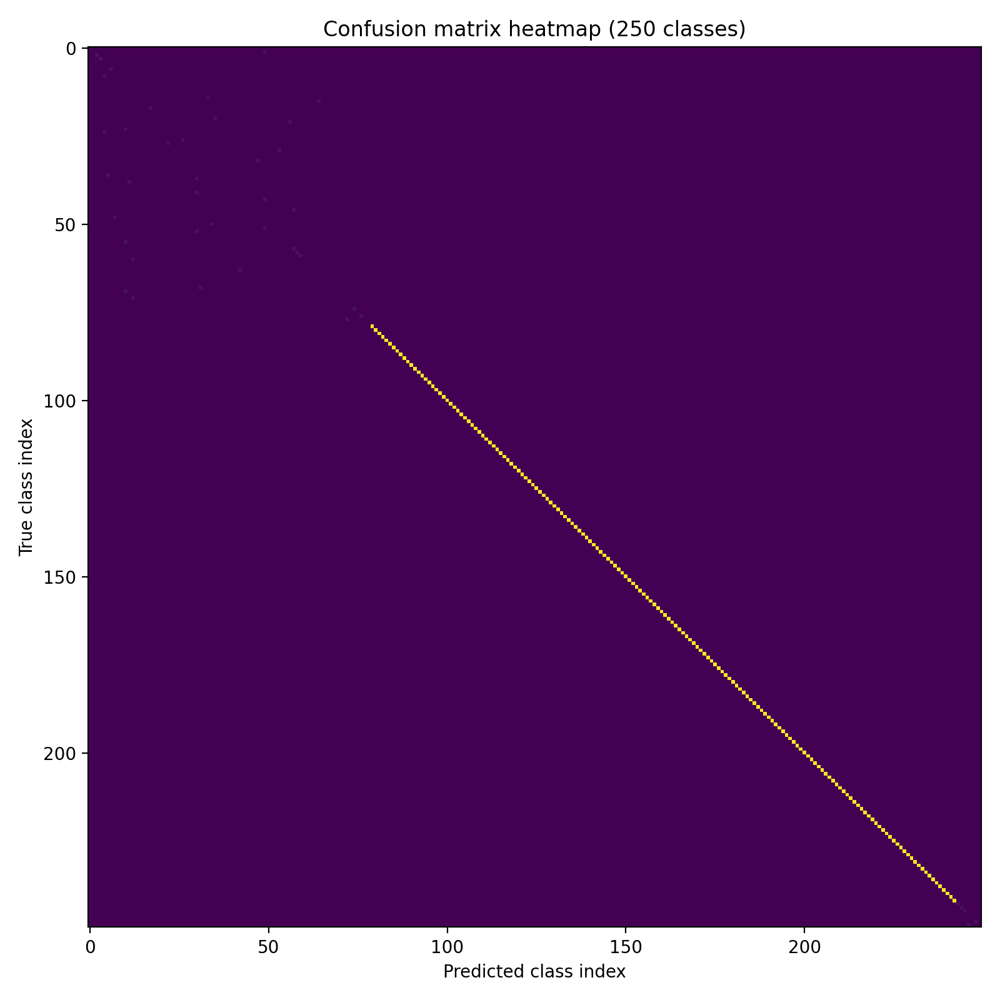

The PCA plot below shows 10 representative location classes from the 250-class subset. The points form different regions in feature space, which visually supports the fingerprinting result. This is the clearest public-dataset plot because it shows that different coordinates occupy different CSI feature regions.

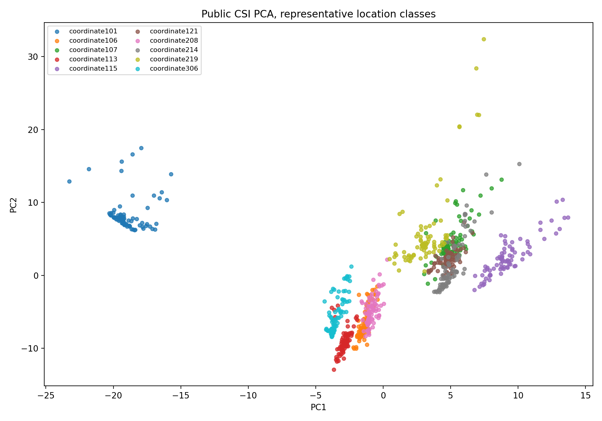

The mean CSI profile plot shows representative CSI profiles from the public dataset. Different coordinate classes have different subcarrier patterns. This explains why a classifier can learn location-specific CSI fingerprints from the dataset.

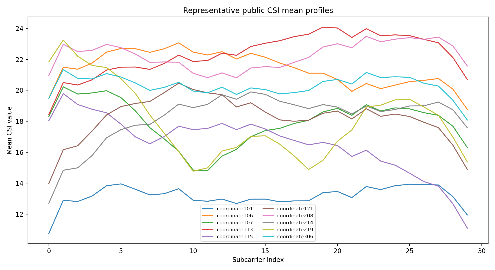

The window-count plot shows the top 30 classes by number of generated windows. In this selected subset, many of the top classes have the same number of windows, so this plot is mainly included as a quick sanity check for sample availability. It also helps explain why the final result should be read as a practical fingerprinting baseline rather than a strict deployment benchmark.

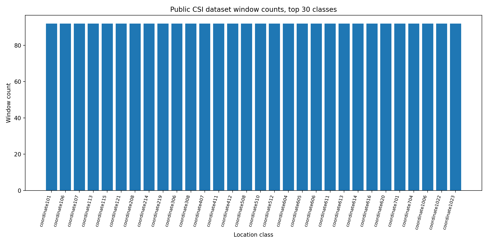

## My own ESP32 CSI experiment

After running the public dataset, I still wanted to see what real CSI looks like from hardware. I had an ESP32 DevKitV1, so I used Espressif's ESP CSI example and collected real CSI from a fixed 2.4 GHz hotspot/router.

The setup was simple:

```text
Phone/router hotspot fixed
ESP32 receiver moved/rotated manually
Laptop connected to ESP32 over USB serial
CSI packets logged from ESP32
```

The board used was an ESP32 DevKitV1 / ESP32 D0WD V3.

### ESP32 hardware setup

I used the ESP32 board shown below.

<p align="center">
  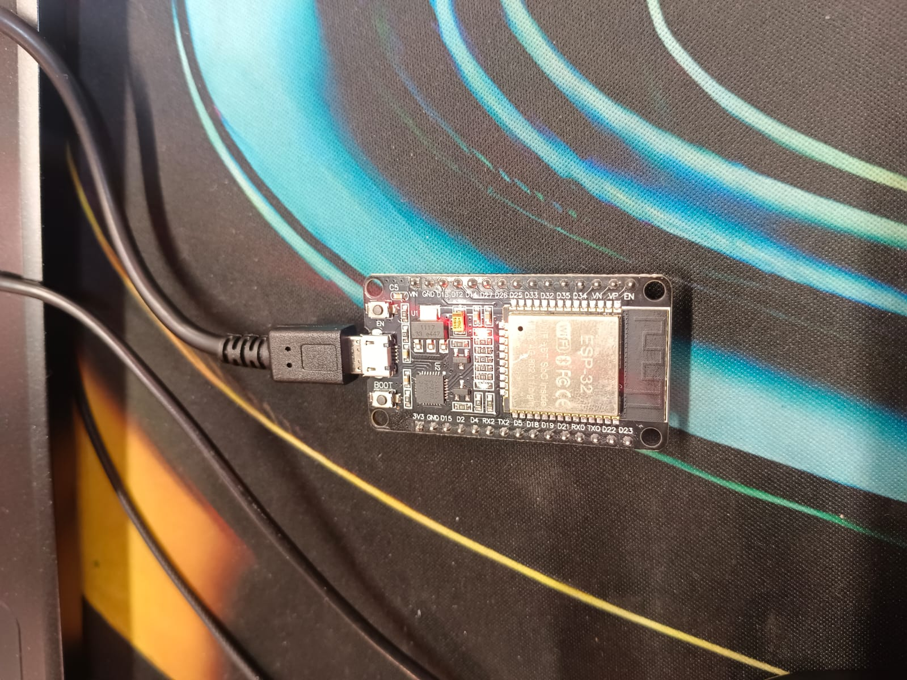
  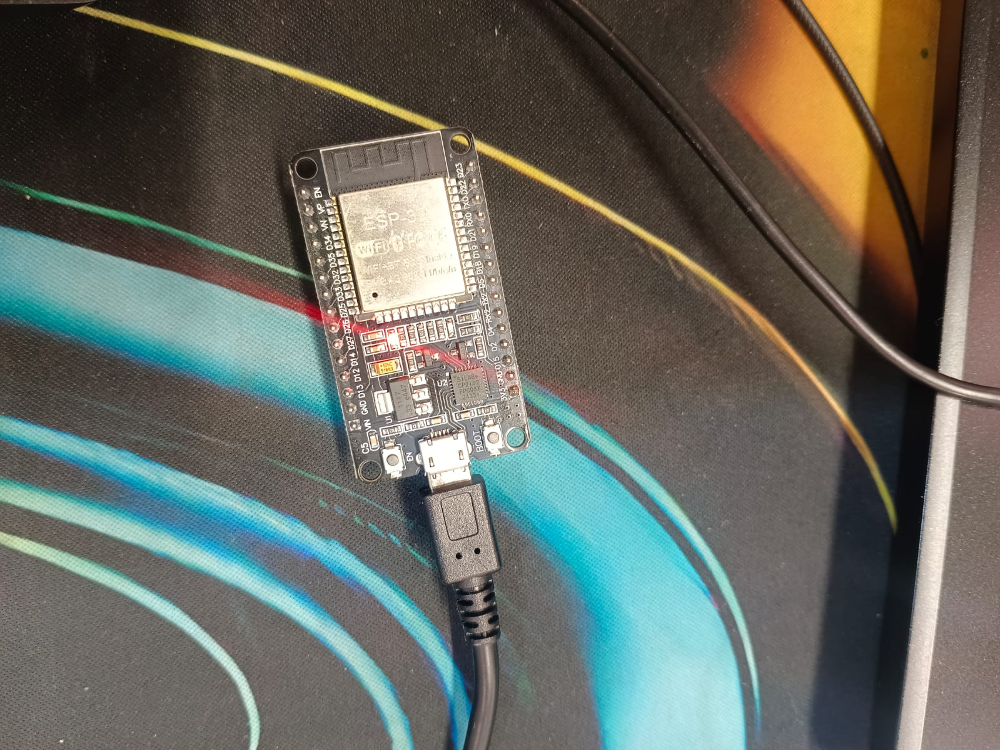
</p>

### Why I did this

The public dataset is most likely collected with static devices. But a drone is not static. It moves, tilts, rotates, and vibrates. So I wanted to test a small version of the drone problem:

```text
Does CSI change if the receiver stays at the same location but rotates?
Does CSI change if the receiver stays at the same location but vibrates?
```

This is important because if CSI changes under yaw or vibration, then CSI is not a pure location fingerprint.

### ESP32 conditions collected

I collected five CSI conditions:

```text
A_yaw0_static
A_yaw90_static
B_yaw0_static
B_yaw90_static
B_yaw90_vibration
```

This corresponds to two physical locations, two yaw orientations, and one drone like vibration condition.

Important note: these are five CSI conditions, not five completely different physical positions.

Packet counts:

```text
A_yaw0_static      2368 packets
A_yaw90_static     3199 packets
B_yaw0_static      3198 packets
B_yaw90_static     2940 packets
B_yaw90_vibration  2938 packets
Total              14643 packets
```

The raw ESP32 CSV files are stored in:

```text
data/esp32_raw/
```

The analysis code is:

```text
code/analyze_esp32_csi.py
```

The results are stored in:

```text
reports/esp32_live/
```

## ESP32 analysis results

For the ESP32 data, I converted CSI packets into amplitude features and then created window level features. The final dataset was:

```text
Packets:        14,643
Window samples: 907
Feature size:   256
```

I trained a Random Forest classifier to separate the five conditions.

Result:

```text
Five condition accuracy = 95.97 percent
```

This means the CSI was different enough across location, yaw, and vibration conditions that a classifier could separate them.

### ESP32 mean amplitude plot

The mean CSI amplitude plot shows how the average CSI profile changes across the five conditions.

```text
reports/esp32_live/mean_amplitude_conditions.png
```

The x axis is the CSI amplitude bin index. The y axis is the normalized amplitude. The different lines correspond to different ESP32 recording conditions. The plot shows that the CSI vector is not random noise. Different location, yaw, and vibration conditions produce different amplitude structures across the bins.

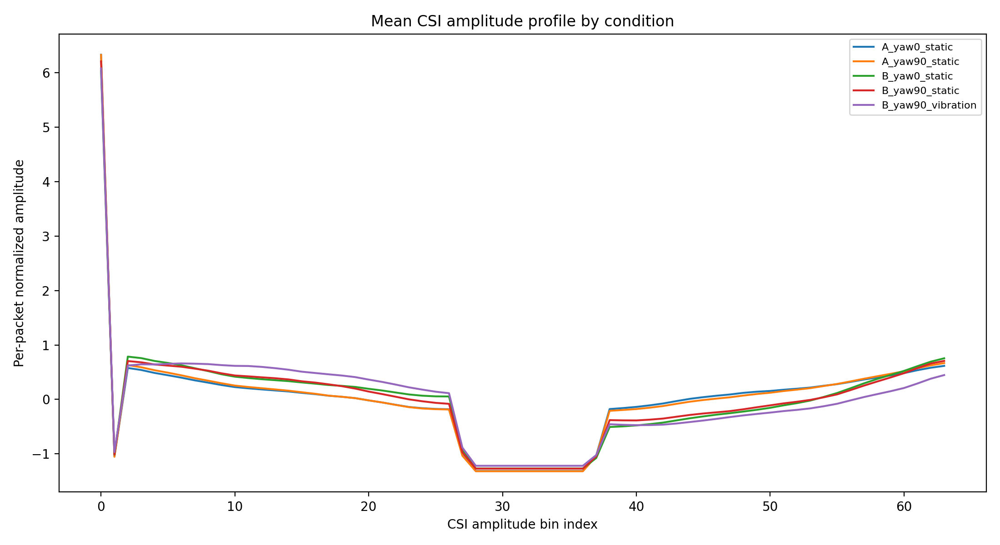

### ESP32 all condition PCA

The all condition PCA plot compresses the window level CSI features into two dimensions.

```text
reports/esp32_live/pca_all_conditions.png
```

This plot gives the overall picture. The clusters are not completely identical, which means the CSI contains information about the condition. It also shows that the vibration condition occupies a different part of feature space compared with the static conditions.

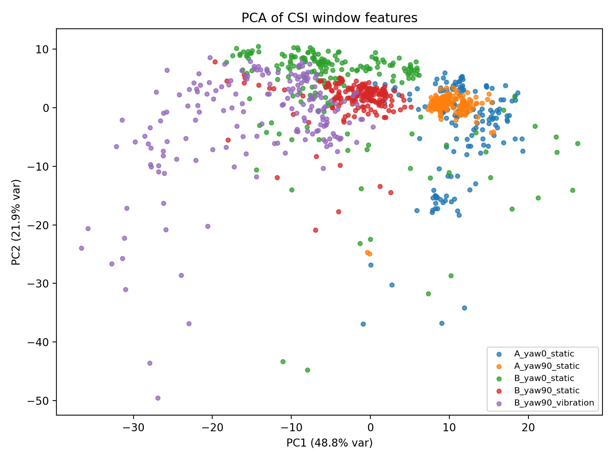

### Location change: A yaw0 vs B yaw0

This plot compares different physical locations while keeping yaw fixed.

```text
reports/esp32_live/pca_location_change_yaw0.png
```

The A and B points form different regions in PCA space. This supports the basic localization idea:

```text
Changing location changes CSI.
```

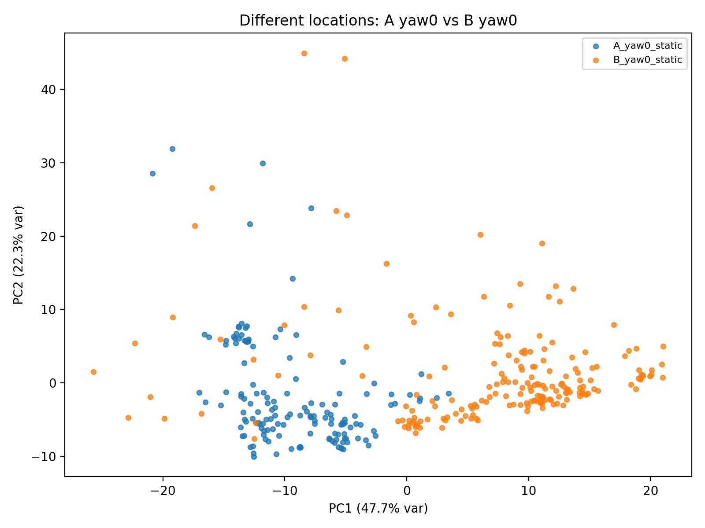

### Orientation change: same location, yaw 0 vs yaw 90

I tested yaw at both locations.

For location A:

```text
reports/esp32_live/pca_same_location_yaw_A.png
```

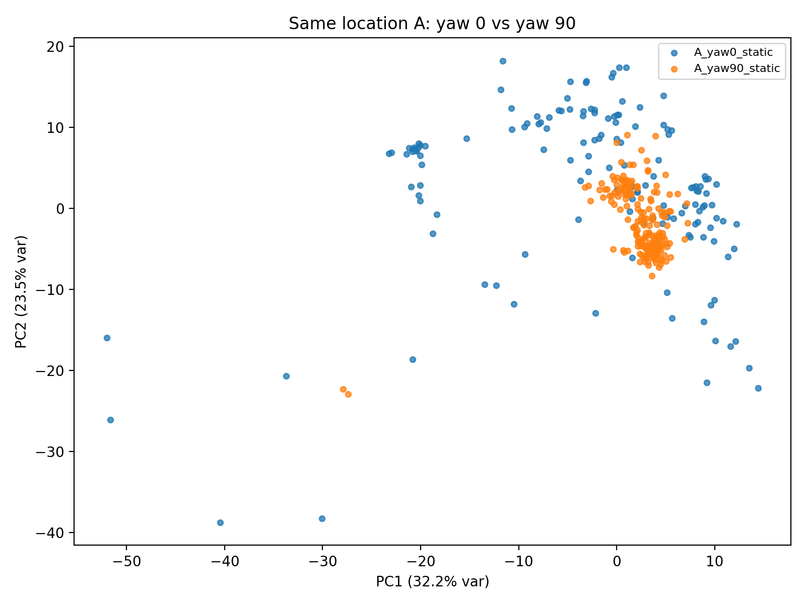

For location B:

```text
reports/esp32_live/pca_same_location_yaw_B.png
```

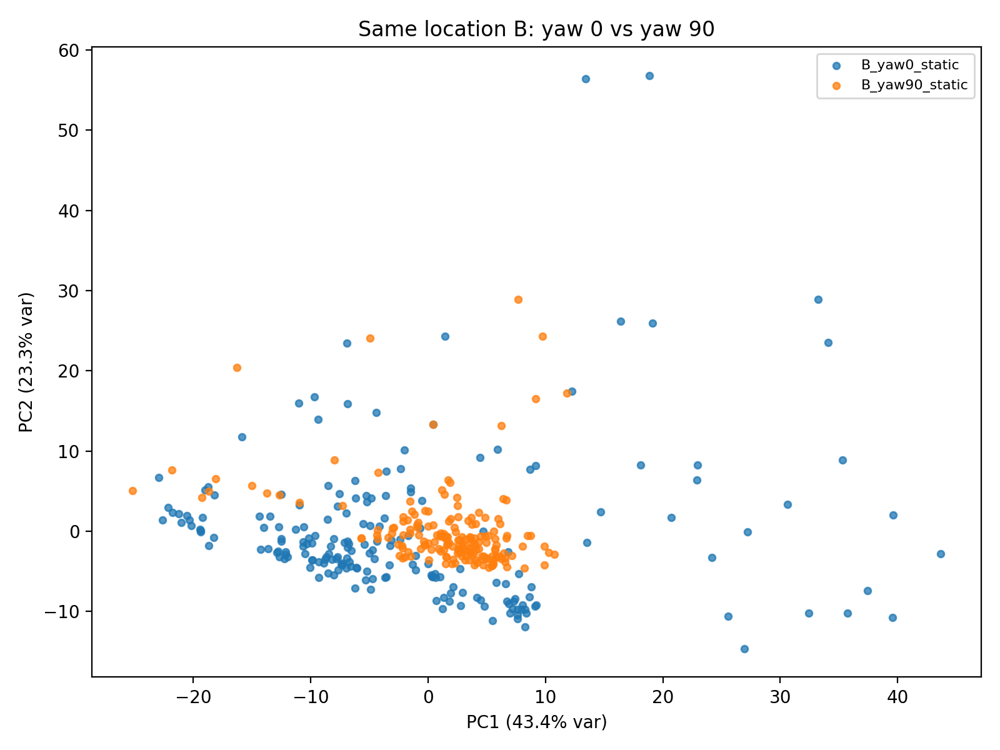

These plots show that receiver orientation affects CSI even when the location is the same. This is one of the main results for the drone question.

A drone constantly changes yaw. So if the training dataset only includes one orientation, the model may fail or become biased when the drone rotates.

### Vibration: same location and yaw, static vs vibration

The vibration test was collected at location B with yaw 90.

```text
reports/esp32_live/pca_static_vs_vibration_B_yaw90.png
```

This was the most drone relevant ESP32 plot. The vibration condition spreads away from the static condition. That means even if the receiver is at the same location and same yaw, physical motion or vibration changes the CSI distribution.

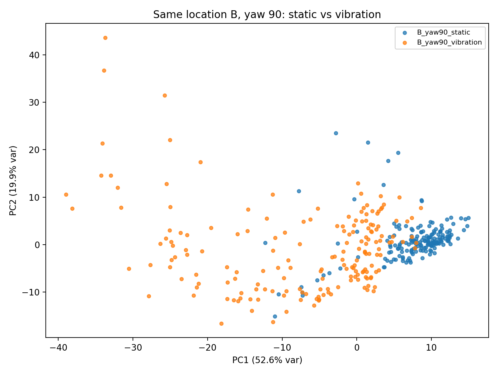

This directly supports the answer to the assignment's drone question:

```text
When the CSI collector is a drone, the CSI changes because the receiver is moving,
tilting, rotating, and vibrating. The measured channel is no longer only a function
of position.
```

### ESP32 condition classifier

The ESP32 five condition classifier produced:

```text
Accuracy = 95.97 percent
```

The confusion matrix is saved here:

```text
reports/esp32_live/confusion_matrix_conditions.png
```

The classifier mostly separated all five conditions. The most meaningful confusion was between `B_yaw90_static` and `B_yaw90_vibration`. That makes sense because they share the same physical location and yaw, but differ by motion.

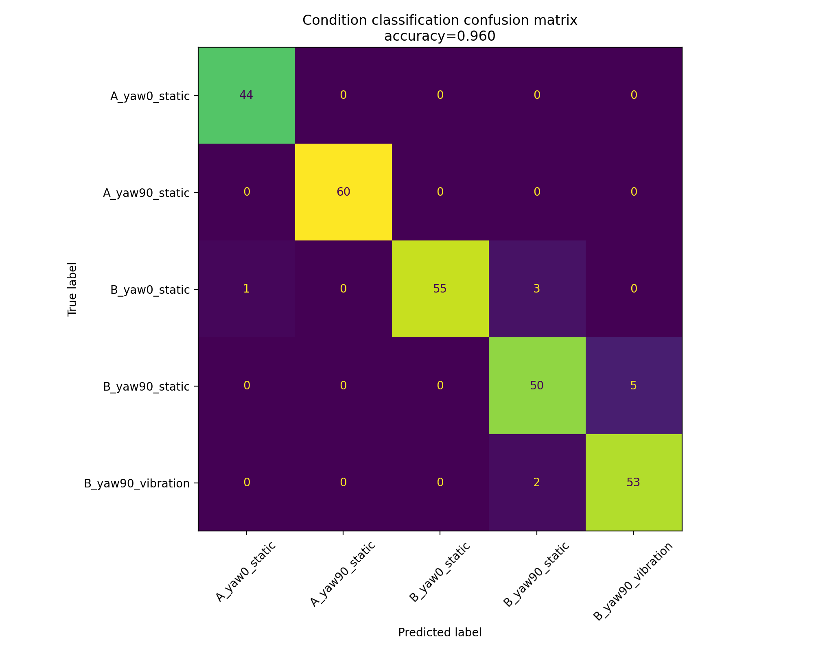

### Yaw shift location test

I also ran a yaw shift location test:

```text
Train on yaw0 data
Test on yaw90 data
Predict location A vs B
```

Result:

```text
Yaw shift location accuracy = 96.84 percent
```

This means that in my small setup, the A/B location difference was still strong enough to generalize across yaw. But it does not mean yaw has no effect. The PCA plots and condition classifier clearly show that yaw changes CSI. It only means that the two locations were different enough that location information remained visible.

```text
reports/esp32_live/confusion_train_yaw0_test_yaw90.png
```

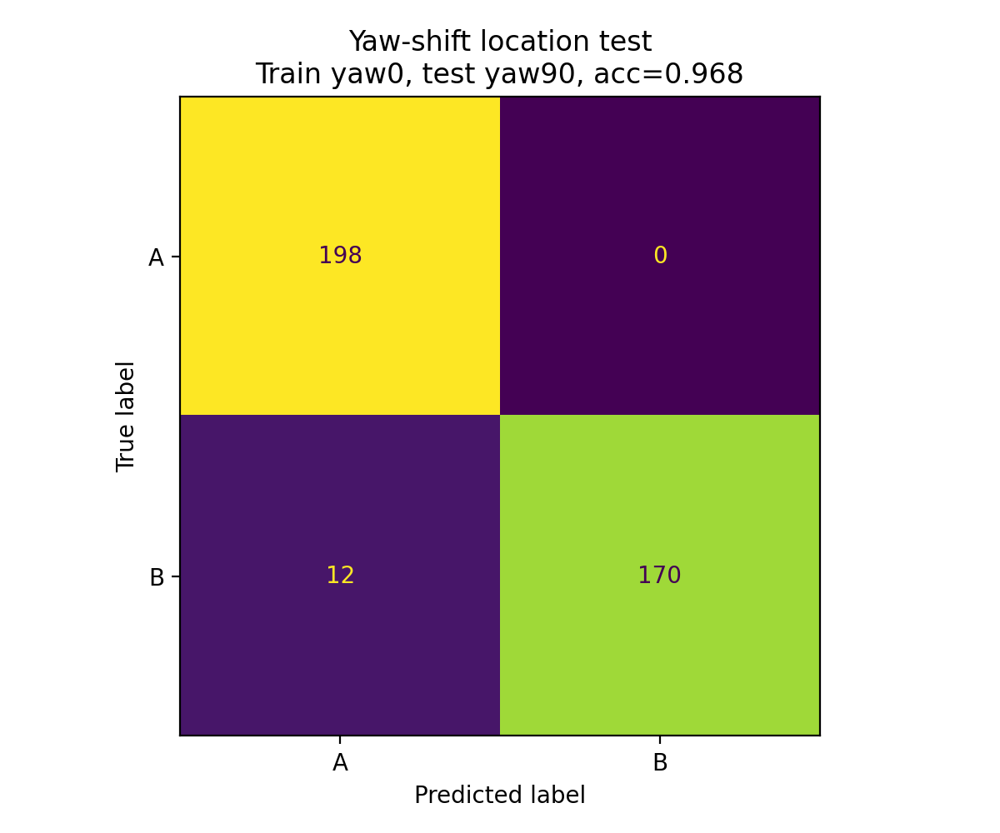

## Drone like CSI simulation

I also implemented a lightweight synthetic CSI motion domain simulator.

The simulator is not a full RF ray tracing simulator. It is a diagnostic simulation to test the static fingerprint assumption.

The simulated CSI model is:

```text
observed CSI =
    location fingerprint
  + yaw/orientation distortion
  + vibration/tilt distortion
  + gain drift
  + noise
```

The code is:

```text
code/csi_drone_motion_sim.py
```

The outputs are saved in:

```text
reports/drone_motion_sim/
```

### Simulation mean profile plot

The mean profile plot compares static CSI fingerprints against drone like fingerprints.

```text
reports/drone_motion_sim/sim_mean_static_vs_drone.png
```

The solid curves are static fingerprints. The dashed curves are drone like fingerprints after yaw, vibration, tilt, gain drift, and noise are added. The curves show that the same location fingerprint can look very different once drone like motion effects are added.

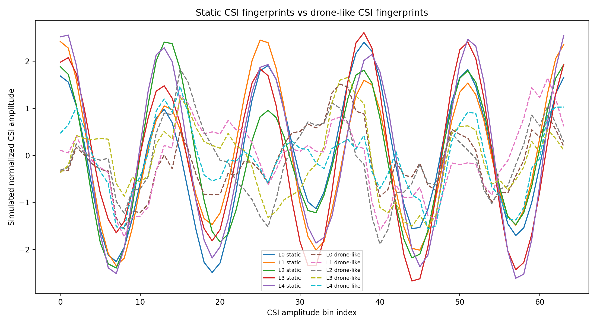

### Simulation yaw sweep

The yaw sweep plot keeps one simulated location fixed and changes only the receiver yaw angle.

```text
reports/drone_motion_sim/sim_same_location_yaw_sweep.png
```

This graph is a controlled version of the ESP32 yaw test. It shows that changing receiver yaw can reshape the CSI profile even when the simulated location is unchanged.

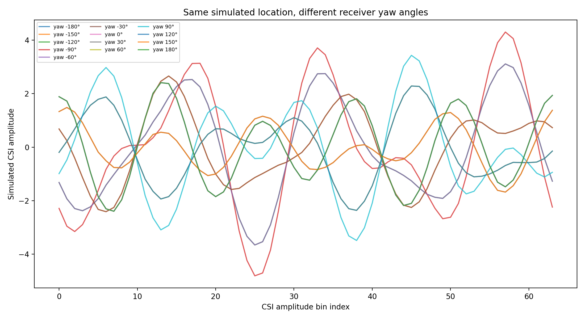

### Simulation classification results

The simulation tested three cases:

```text
Train static -> test static:                      1.000
Train static -> test drone like:                  0.392
Train static + motion augmentation -> drone like: 0.996
```

When training and testing conditions match, the classifier works perfectly:

```text
reports/drone_motion_sim/sim_confusion_static_train_static_test.png
```

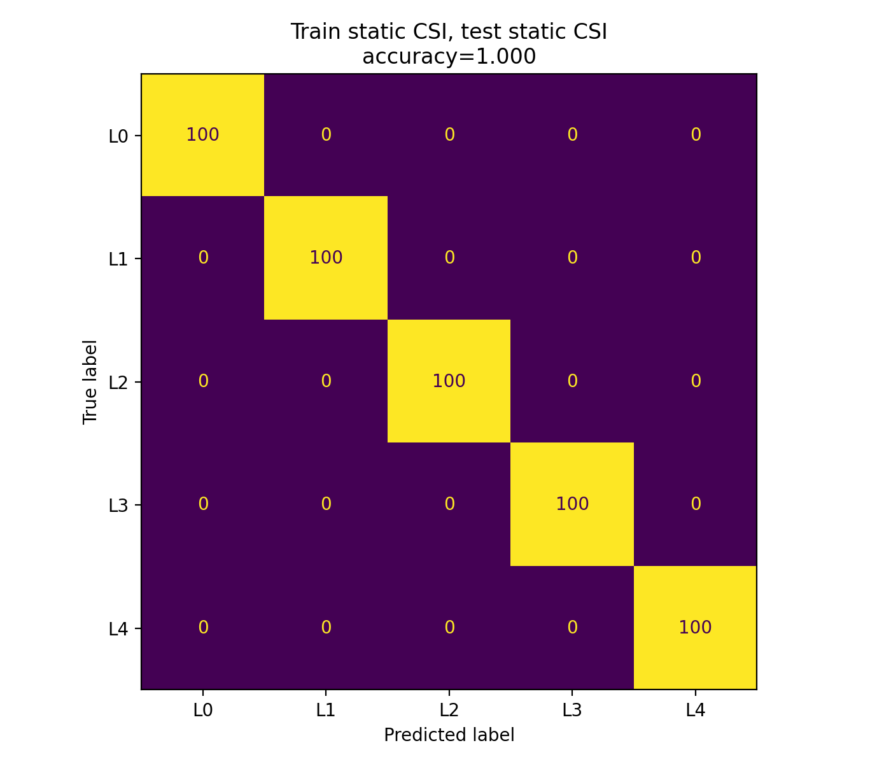

But when the classifier is trained on static CSI and tested on drone like CSI, performance drops badly:

```text
reports/drone_motion_sim/sim_confusion_static_train_drone_test.png
```

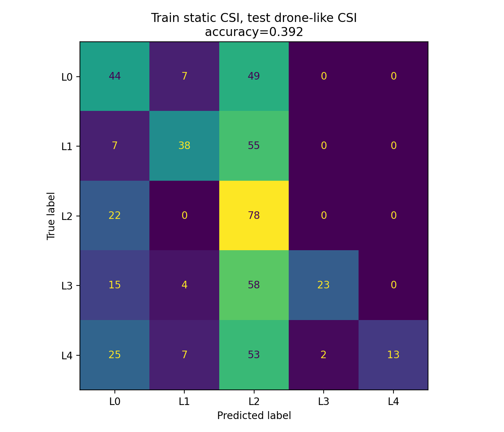

Then, when motion augmented CSI is included during training, drone like performance recovers:

```text
reports/drone_motion_sim/sim_confusion_augmented_train_drone_test.png
```

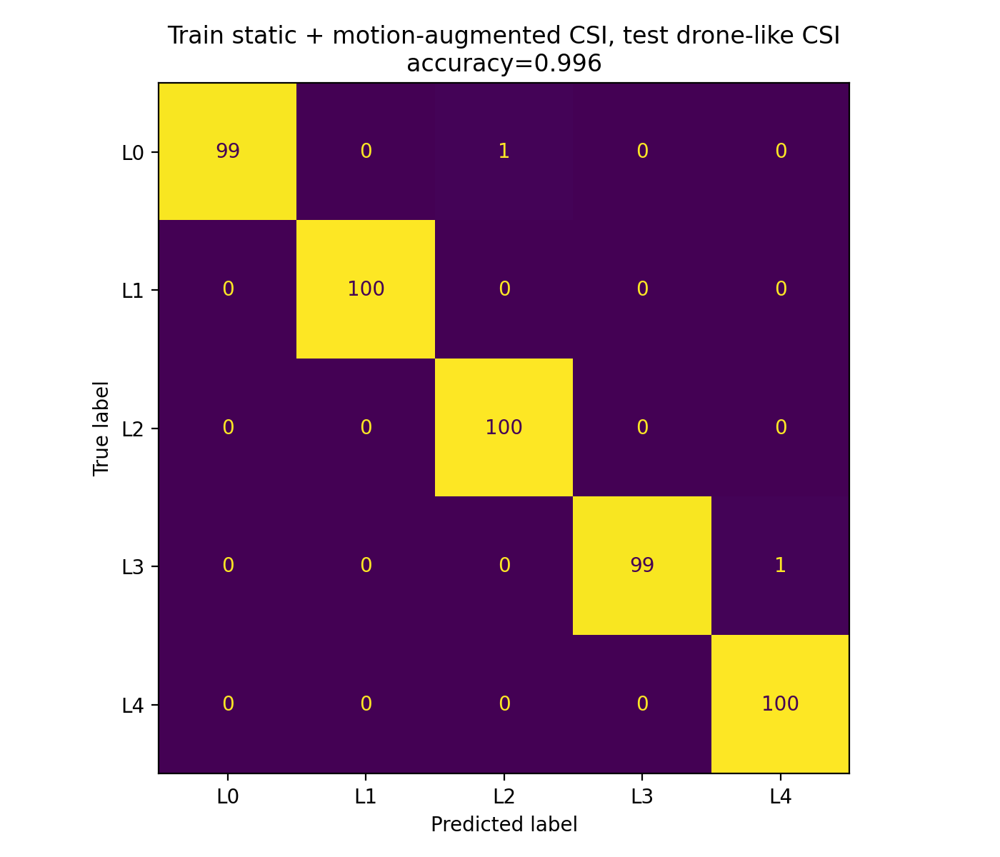

### Simulation PCA plots

The static vs drone like domain shift is visible here:

```text
reports/drone_motion_sim/sim_pca_static_vs_drone_domain.png
```

In this plot, the static test points occupy a compact region, while the drone like test points spread into a different domain. That is the visual version of the performance drop from 1.000 to 0.392.

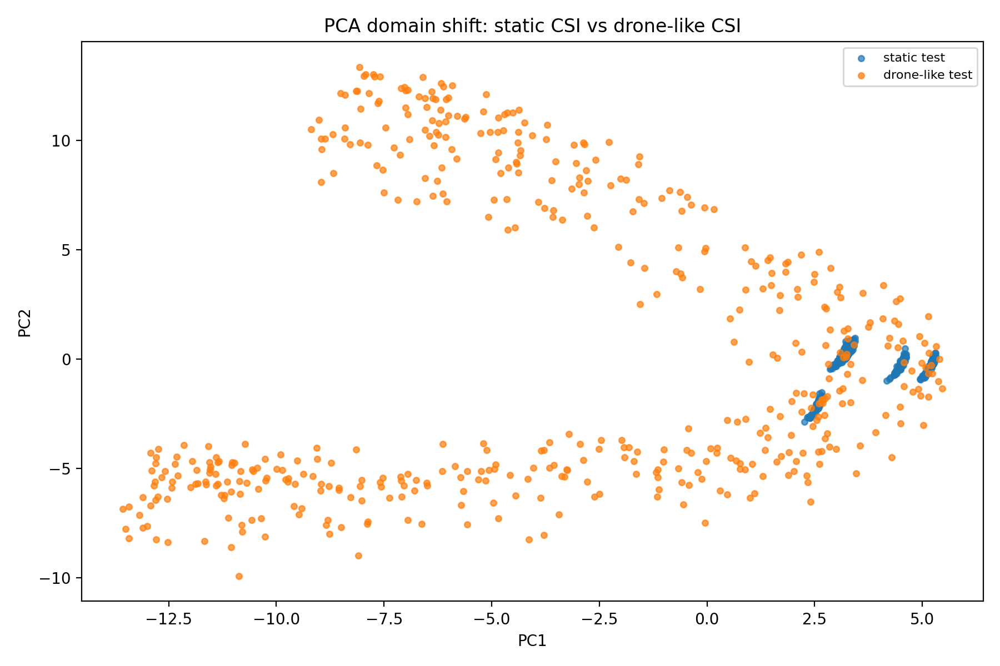

The motion augmented training data covers the drone like test domain better:

```text
reports/drone_motion_sim/sim_pca_augmented_coverage.png
```

Here, the motion augmented training samples overlap much more with the drone like test samples. That is why the classifier recovers to 0.996 accuracy in the augmented case.

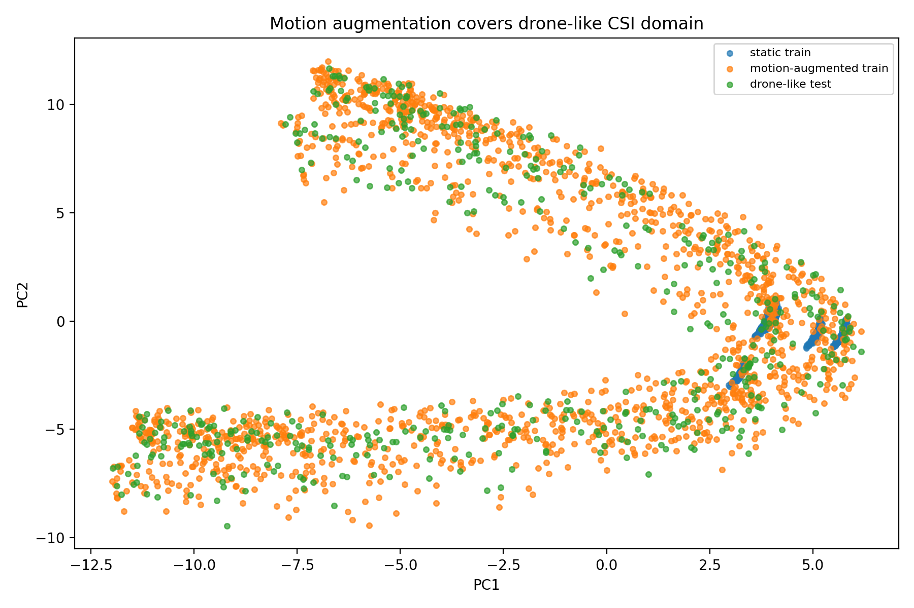

This supports the idea that a drone CSI model should be trained with motion and pose diversity.

## What changes when the CSI collector is a drone?

This is the most important question in the assignment.

In a static CSI dataset, the receiver is usually fixed or moved carefully between known positions. The CSI mainly changes because of location and multipath.

For a drone, many more things change.

### 1. Yaw, pitch, and roll change the antenna response

A drone does not keep the receiver antenna fixed in one orientation. Even if the drone is at the same xyz position, yaw or roll can change the measured CSI.

My ESP32 yaw experiment showed this directly.

### 2. Vibration changes the CSI distribution

Drone motors create vibration. Small changes in antenna position or orientation can affect WiFi phase and amplitude.

My ESP32 vibration run showed that static and vibration data at the same location and yaw can separate in PCA space.

### 3. Motion creates time varying channels

A static dataset is usually a set of snapshots. A drone sees a time varying channel while moving through space. Consecutive CSI packets are not independent. They are part of a trajectory.

### 4. The drone body can reflect or block WiFi

The frame, battery, camera, and electronics can change the antenna pattern and create additional multipath.

### 5. Hardware effects matter

CSI can be affected by automatic gain control, calibration, packet rate, WiFi channel, antenna placement, and driver behavior.

### 6. The problem becomes sensor fusion, not just classification

For a real drone, CSI should probably not replace IMU/VIO. It should be fused with them.

A more realistic drone system would use:

```text
CSI + IMU + VIO / optical flow / depth
```

CSI can provide an additional indoor localization cue, especially when cameras struggle, but it should be motion aware.

## My final takeaway

WiFi CSI is genuinely useful for indoor localization because it captures multipath structure that changes with location. The public dataset experiment showed that even a simple classifier can detect strong location specific CSI patterns.

But for drone navigation, static CSI fingerprinting is not enough.

The ESP32 experiment showed that real CSI changes with:

```text
location
receiver yaw
drone like vibration
```

The simulation showed that:

```text
static training can fail under drone like CSI,
but motion and pose augmentation can help.
```

So my final conclusion is:

```text
CSI can be useful for GPS denied drone navigation, but not as a naive static fingerprint.
A practical drone CSI system should collect data with yaw, tilt, and vibration diversity,
use pose aware augmentation, and ideally fuse CSI with IMU/VIO.
```

## How I think this could be used on a drone

I do not think CSI should be used as a standalone replacement for VIO, IMU, optical flow, or depth sensing on a drone. A more realistic use would be as an extra localization cue in a sensor-fusion system. 

The drone can use IMU data to estimate fast roll, pitch, yaw, acceleration, and vibration state, while VIO or optical flow estimates short-term motion. CSI can then act like a correction signal when the drone is indoors and WiFi infrastructure is available. 

For example, instead of asking CSI to directly output the full drone pose, the system could learn a CSI-based location likelihood and combine it with IMU/VIO in a filter or SLAM framework. The important part is that the CSI model should know the drone pose and motion state, because the same physical location can produce different CSI when the drone yaws, tilts, or vibrates. 

So the practical version would be: collect CSI together with IMU and pose labels, train with yaw/tilt/vibration diversity, and use CSI as a supporting signal for GPS-denied indoor navigation.

## Repository structure

```text
.
├── README.md
├── requirements.txt
├── code/
│   ├── inspect_dataset.py
│   ├── train_csi_baseline.py
│   ├── analyze_esp32_csi.py
│   └── csi_drone_motion_sim.py
├── data/
│   ├── raw/
│   │   ├── public_localization_250/
│   │   └── public_localization_full_coordinates/
│   └── esp32_raw/
├── reports/
│   ├── public_csi_location_250_fast/
│   ├── esp32_live/
│   └── drone_motion_sim/
└── assets/
    ├── esp32_setup_1.jpeg
    └── esp32_setup_2.jpeg
```

## How to run

### Install dependencies

```bash
python3 -m venv .venv
source .venv/bin/activate
pip install -r requirements.txt
```

### Inspect a CSI dataset

```bash
python code/inspect_dataset.py \
  --data_dir data/raw/public_localization_250
```

### Run the public CSI baseline

```bash
MPLBACKEND=Agg python code/train_csi_baseline.py \
  --data_dir data/raw/public_localization_250 \
  --label_mode parent \
  --out_dir reports/public_csi_location_250_fast \
  --model rf \
  --window_size 32 \
  --stride 16 \
  --test_size 0.25
```

### Analyze ESP32 CSI data

```bash
MPLBACKEND=Agg python code/analyze_esp32_csi.py \
  --raw_dir data/esp32_raw \
  --out_dir reports/esp32_live \
  --window_size 32 \
  --stride 16
```

### Run the drone motion simulation

```bash
MPLBACKEND=Agg python code/csi_drone_motion_sim.py \
  --out_dir reports/drone_motion_sim
```

## Notes and limitations

This project is exploratory. The public dataset result is a window based CSI fingerprinting baseline, not a strict cross session benchmark. The ESP32 experiment is a small sanity check, not a full drone dataset. The simulation is a diagnostic synthetic simulator, not a calibrated RF ray tracer.

The public dataset is not committed because it is large. To rerun the public dataset baseline, download the public CSI indoor-localization dataset from this GitHub repository: https://github.com/qiang5love1314/CSI-dataset. Then recreate the subset under `data/raw/public_localization_250`. The generated reports are already included in `reports/public_csi_location_250_fast`.

Still, the three parts point to the same conclusion:

```text
CSI has location information,
but drone motion changes CSI enough that static datasets are not sufficient.
```

## References I read

* Ma et al., WiFi Sensing with Channel State Information: A Survey
* Kotaru et al., SpotFi: Decimeter Level Localization Using WiFi
* Wang et al., DeepFi: Deep Learning for Indoor Fingerprinting Using CSI
* Widar3.0: Cross domain WiFi sensing / gesture recognition
* DLoc: Deep learning based wireless localization for indoor navigation
* rWiFiSLAM: WiFi and IMU based indoor SLAM
* Wi Drone: WiFi based 6 DoF tracking for indoor drone flight
* CiUAV: CSI based 3D indoor UAV localization
